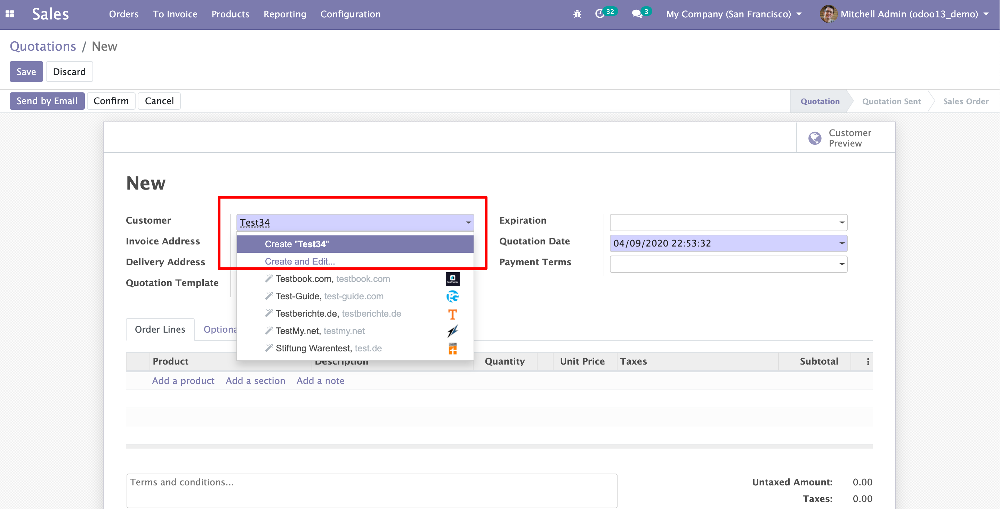
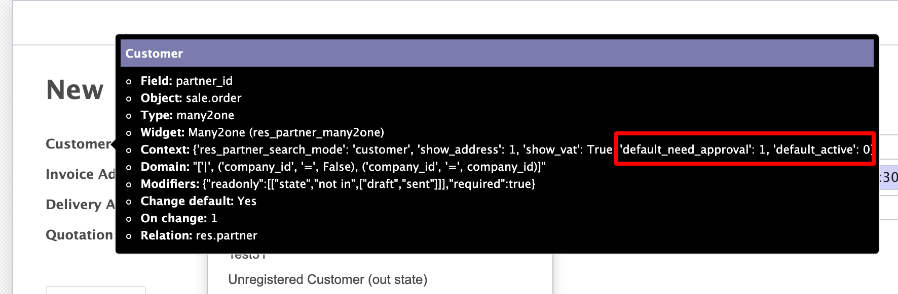
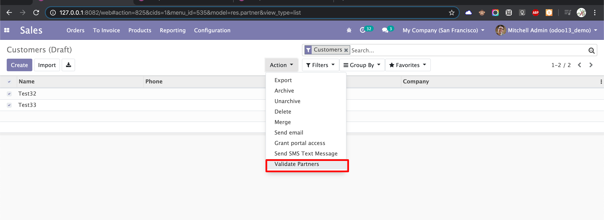

# Partner Approval

- In Sale Order, while creating customer using dropdown options `Create` and `Create And Edit`.

- That customer Record doesn't directly showing in customer menu. Once Validation completed from Customer(Draft) menu, then only it will appear.

- We Can use this feature for any other partner fields in any model, using following procedure.
    
## Menu and Features
    
- Menu in Sales -> Orders -> Customers (Draft)

")

- Create and Edit option in Sale order

- Add Default Context with follwing, we can use for any other partner fields in future

- Customer (Draft) -> Validation and Warning

 -> Validation and Warning")

- Create Record from Customers (Draft) menu, those contacts need validation automatically enable.

 menu, those contacts need validation automatically enable")

- Bulk Partner Validation

